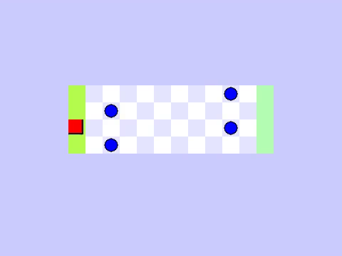
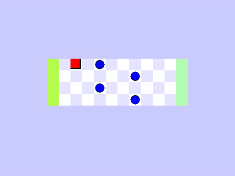

**27-July**\
*Reward*: \
+10 if win\
-10 if lose\
+(11-distance)/11 while agent in map\
*train* with <= 3M steps\
Model have only 1 layers (64 unit)\
Memory == 1M start at 50000\
Use Adam  'mae' metrics\
**Conlusion**: The agent can realise the position of it to earn the max point. But it dont end the game\

**31-July**\
**--------Model 1----------**
Without random agent position
*Reward*: \
+10 if win\
-10 if lose\
-(11-distance)/11 while agent in map\
*train* with <= 12M steps\
Model have only 1 layers (64 unit)\
Memory == 1M start at 50000\
Use Adam  'mae' metrics\
**Conlusion**: The agent can win! Use the weights of Model 1 with random agent postion

With random agent position
**Conlusion**: The agent can win a lot of games but there are a lot of times it die in ridiculous way. Why is this happened?

**--------Model 2----------**
Without random agent position
*Reward*: \
+10 if win\
-10 if lose\
-(11-distance)/11 while agent in map\
*train* with <= 12M steps\
Model have only 1 layers (64 unit)\
Memory == 1M start at 50000\
Use Adam  'mae' metrics\
**Conlusion**: The agent can realise the position of it to earn the max point. But it dont end the game\

With random agent position

